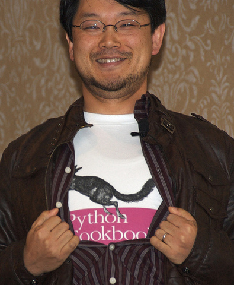

> A dynamic, open source programming language with a focus on simplicity and productivity. It has an elegant syntax that is natural to read and easy to write.
> 
> **Ruby Lang**, http://ruby-lang.org

- - -

> Ruby is a dynamic, reflective, general purpose object-oriented programming language that combines syntax inspired by Perl with Smalltalk-like features. Ruby originated in Japan during the mid-1990s and was initially developed and designed by Yukihiro "Matz" Matsumoto. It is based on Perl, Smalltalk, Eiffel, Ada, and Lisp.
> 
> **Wikipedia**, http://en.wikipedia.org/wiki/Ruby_(programming_language)

You didn't come here to read about a few definitions, though. You came here to learn about Ruby (or else you're going to be mildly disappointed). So let's learn about Ruby: Ruby is a programming language. Ok, so you probably figured that out already. Here's some important information that wont make sense yet: The Ruby programming language is expressive, imperative, and object-oriented. Ruby doesn't require a compile step, but instead is interpreted by an interpretor. The Ruby programming language is geared toward and designed for both simplicity and enjoyability. Ruby's goal is to make development very fun and easy for developers.

> Experienced programmers should take note of the term "Object-Oriented." That's not "Object-Curious", or "Object-Casual." This isn't that one time at band camp when your program let another modify his orientation for the night. This is an object-oriented language and you'll be dealing with Classes and Objects the entire time. Everything, and I do mean everything, is an Object in Ruby, even the results from methods (a more manlier word for function) are an Object.

Ruby was officially named on 1993-02-24 in Japan by it's creator Yukihiro "Matz" Matsumoto. The language went public 1995-12-21 with Ruby v0.95. Ruby v1.0 wouldn't crawl around until a year later, 1996-12-25. Somewhere during the year 2000 Ruby would finally become used mainstream outside of Japan, and on 2001-12-15 the Pragmatic Programmers released Programming Ruby, otherwise known as _Pickaxe_. 2001 also happened to be the year of the ever successful convention, RubyConf? which was first called RubyConf?.new(2001). It's an inside joke you'll get later.

The ball didn't start really rolling until David "DHH" Heinmeier hit the scene. Mr. Heinemeier designed and created Rails (Usually called Ruby On Rails) and opened the source on 2004-07. He didn't give commit rights (The right to change the code) to anyone else until 2005-02 and even then it's a strict list. Rails exploded onto the web development scene like the Virut virus on an unsuspecting computer. DHH had single handedly made web development enjoyable, the cad. Apple Inc. picked up on this crazy development in the webtech scene and announced that Mac OS X (10.5, Leopard) would ship with the latest Rails in 2004-08.

The real question you want to know (most likely) is what the language is "good for", or at least used for. The answer to this is easy: Everything. Want a script that sorts, edits, or deletes your files? Can do. Want to write a pretty GUI (Graphic User Interface)? Yep, in spades. Pushing out an extensive and complex web application? Twitter, YelloPages, and Github did it with Rails. You will be doing simpler things of course, but all these projects and more are within the grasp of even average people if they put their mind to it. In fact, here's a (very small) list of examples:

* [Sinatra](http://sinatrarb.com), a micro-web framework and DSL for creating tiny (or complex) web applications!
* [Hackety Hack](http://hacketyhack.heroku.com/), a wonderful programming introduction for children, by \_why.
* [Padrino](http://www.padrinorb.com/), built on the Sinatra micro-web framework is the Padrino web framework. The Sinatra man's Rails.
* [Event Machine](http://rubyeventmachine.com/), an event based server. Incredibly easy to build on (Trust me!).
* [Mongrel](http://github.com/fauna/mongrel), the powerful HTTP server built by Zed Shaw.
* [Rake](http://rake.rubyforge.org/), all the simplicity of Ruby for powerful makes.

Ruby has a lot of good facets (haha, precious gem joke) that are very easy to identify: Ruby is powerful and elegant, easy to read and detailed, with enterprise and open source in mind. All these are pretty much buzz words when you get down too it so the real good side of Ruby is that it's easy and fun. These are traits not often found in programming languages. Like all programming languages and tools Ruby has a place and use that it is best fit for: Web development.

Like every other language Ruby has some bad parts too. The Ruby Community is so terrible that I've devoted an entire chapter just to the culture around Ruby. The standard Ruby interpretor (1.8) is really slow compared to pretty much every other modern used language. The latest stable version (1.9) is only just now coming into broad usage by developers. Ruby isn't scalable naturally for the most part, and requires external sources and languages to assist it. One programmer has told me that the long time solution to this was, "Run more machines with Ruby," which is an obviously flawed approach. Open Ruby projects tend to have serious little or poor documentation and for the most part hasn't improved.
